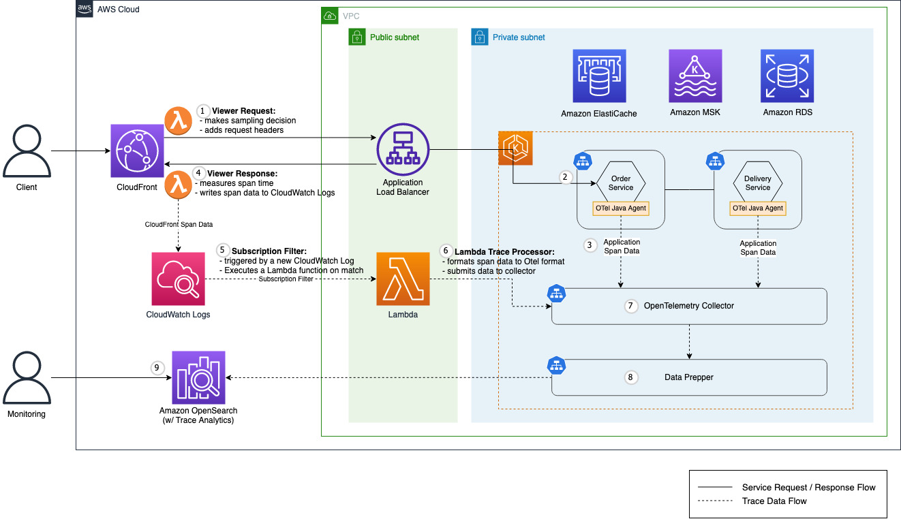

## Setting up end-to-end tracing that starts from Amazon CloudFront using OpenTelemetry

## Introduction
In this blog, you will learn how to setup an end-to-end tracing with [OpenTelemetry](https://opentelemetry.io/) that starts from Amazon CloudFront. An end-to-end tracing, or E2E tracing is a great tool to have in order to identify problems in a modern, distributed architecture. Although a tracing starts from Amazon CloudFront technically does not qualify as a true end-to-end tracing since it does not consider the things happen in the client, you can expand the concepts covered in this post and setup your own E2E tracing starting from your clients.  
  
Unlike Amazon API Gateway, Amazon CloudFront does not support tracing out of the box. But thanks to [CloudFront Function,](https://aws.amazon.com/lambda/edge/) Amazon CloudFront can send OpenTelemetry compatible message to a OpenTelemetry Collector and the traces can be aggregated in your preferred backend including but not limited to [Jaeger](https://www.jaegertracing.io/), [Zipkin](https://zipkin.io/), [Prometheus](https://prometheus.io/), Elasticsearch or [Amazon Opensearch](https://aws.amazon.com/opensearch-service/).  
  
In this post, we will be using [Amazon Opensearch](https://aws.amazon.com/opensearch-service/) as my backend to enjoy the benefit of [Opensearch Trace Analytics](https://docs.aws.amazon.com/opensearch-service/latest/developerguide/trace-analytics.html)for visualizing the traces. But you are free to use different backend of your choice.   
  
You can find all of the code and resources used throughout this post in [the associated GitHub repository](https://github.com/aws-samples/Load-testing-your-workload-running-on-Amazon-EKS-with-Locust).  
  

## Overview of solution

We’ll demonstrate end-to-end tracing with the above architecture. A demo application (“demo app”) is hosted in an EKS cluster to process end-user requests. Its API endpoint is exposed to the public via CloudFront. We use OpenTelemetry to trace user requests to the demo app API.  

OpenTelemetry is a set of APIs, SDKs, tools and integrations designed for telemetry data such as traces, metrics, and logs. It serves as a common specification to generate and collect telemetry data in vendor-agnostic way. We use OpenTelemetry to instrument trace logs generated from a CloudFront distribution and the microservices.  

Specifically, we use the OpenTelemetry Java Agent to instrument the demo app written in Java. With simple configuration, the agent can automatically instrument Java applications. In contrast, there is no such auto instrumentation available for CloudFront, so we’ll build an OpenTelemetry compatible payload within a Lambda function and make a HTTP POST request to the same OpenTelemetry Collector that ingests auto-instrumented traces from Java applications.  

The Collector serves as a common facade to collect, process, and export telemetry data to a tracing back-end of your choice. In this blog, we adopt Amazon OpenSearch as the tracing back-end. At this time, the OpenTelemetry format cannot be directly ingested to OpenSearch, so we use Data Prepper in between to convert data format.  
  

## Installation
In this section, we explain steps to install the presented architecture in your AWS account.

### Prerequisites
You need an AWS account and 
[have AWS CLI configured](https://docs.aws.amazon.com/cli/latest/userguide/cli-chap-getting-started.html)
in your work environment.

We use Terraform to deploy AWS resources as well as some Kubernetes objects. Thus, you might need the following tools in your work environment:
- [Terraform](https://learn.hashicorp.com/tutorials/terraform/install-cli) ([check version release](https://github.com/hashicorp/terraform/releases))
- [kubectl](https://kubernetes.io/docs/tasks/tools/#kubectl) ([check version release](https://kubernetes.io/releases/))
- [Helm](https://helm.sh/docs/intro/install/) ([check version release](https://github.com/helm/helm/releases))

To store Terraform state files in an Amazon S3 bucket, 
you should [create a bucket](https://docs.aws.amazon.com/AmazonS3/latest/userguide/create-bucket-overview.html) 
in your AWS account.

### Host Application Docker Image
We use the Terraform Helm Provider to deploy demo app to the EKS cluster. 
The demo app's source code and Dockerfile are provided so that you can build and host an application Docker image 
in your private repository. Please note that the EKS cluster should have access to your image repository. 
The simplest approach is to create an ECR repository in the same AWS account, and we provide detailed instruction in the 
[README](https://github.com/aws-samples/amazon-cloudfront-end-to-end-tracing-with-opentelemetry/tree/main/groundwork/prepare-application-docker-images) file.

### Run Terraform
First, we input application image repository names to Terraform. 
Replace AWS Region and repository names in the below script and execute the script.
```
# Move to working directory
cd groundwork/provisioning-infrastructure

# Append sample image repository information to terraform.auto.tfvars
export AWS_REGION="<<YOUR_REGION>>"   # ex. ap-northeast-2
export ACCOUNT_ID=$(aws sts get-caller-identity --output json | jq ".Account" | tr -d '"')
export ECR_URL="${ACCOUNT_ID}.dkr.ecr.${AWS_REGION}.amazonaws.com"
export DEMO_APP_REPO_NAME="demo-app"

echo demo_app_repository=\"$ECR_URL/$DEMO_APP_REPO_NAME\" >> ./terraform.auto.tfvars
```
Then, open the [main.tf](https://github.com/aws-samples/amazon-cloudfront-end-to-end-tracing-with-opentelemetry/blob/main/groundwork/provisioning-infrastructure/main.tf) file. 
Enter the name and region of the bucket you created earlier and save the file.
```
# main.tf

terraform {
  required_providers {
    aws = {
      source  = "hashicorp/aws"
      version = "~> 4.12.0"
    }
    helm = {
      source  = "hashicorp/helm"
      version = "~> 2.6.0"
    }
  }
  backend "s3" {
    bucket = "<<YOUR S3 BUCKET NAME>>"
    key    = "terraform/terraform.tfstate"
    region = "<<YOUR S3 BUCKET REGION>>"
  }
}
```
Finally, run Terraform to install resources in your account.
```
# Initialize Terraform providers
terraform init

# verify Terraform plan
terraform plan

# Provision infrastructure
terraform apply
```


### Clean Up
To clean up the resources installed with Terraform, you can run the command below:
```
terraform destroy
```
Lastly, remove your S3 bucket and the demo app ECR repository.


## Reference
-   OpenTelemetry Doc: [What is OpenTelemetry](https://opentelemetry.io/docs/concepts/what-is-opentelemetry/)
-   [AWS Open Source Blog: Distributed tracing with OpenTelemetry](https://aws.amazon.com/blogs/opensource/distributed-tracing-with-opentelemetry/)
-   AWS Cloud Operations & Migrations Blog: [Build an observability solution using managed AWS services and the OpenTelemetry standard](https://aws.amazon.com/blogs/mt/build-an-observability-solution-using-managed-aws-services-and-the-opentelemetry-standard/)