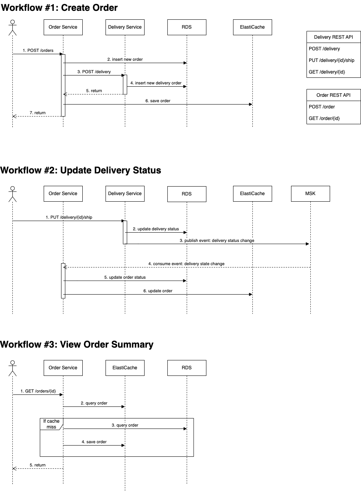

# Sample microservices for E2E Tracing Blog

This sample consists of two microservices (order & delivery microservices),
developed to be used with the IaC code to illustrate end-to-end tracing using OpenTelemetry.

## How to use

To use this sample with the IaC code, you should build the docker image of each service 
and host the images in your private repository.
The <code>dockerfile</code>'s are available in each sub-directory.

Below, we describe the steps to build docker images and host them on Amazon ECR.

i) Create ECR repositories
```
# check your AWS CLI configuration before you proceed

export ORDER_SERVICE_REPO_NAME="e2e-sample-order"
export DELIVERY_SERVICE_REPO_NAME="e2e-sample-delivery"

aws ecr create-repository --repository-name ${ORDER_SERVICE_REPO_NAME} --output json | jq
aws ecr create-repository --repository-name ${DELIVERY_SERVICE_REPO_NAME} --output json | jq
```

ii) Build docker images
```
make build    # Refer to Makefile
```

iii) Tag the images
```
export AWS_REGION="YOUR_REGION"   # ex. ap-northeast-2
export ACCOUNT_ID=$(aws sts get-caller-identity --output json | jq ".Account" | tr -d '"')
export ECR_URL="${ACCOUNT_ID}.dkr.ecr.${AWS_REGION}.amazonaws.com"

docker tag e2e-sample-order:latest ${ECR_URL}/${ORDER_SERVICE_REPO_NAME}:latest
docker tag e2e-sample-delivery:latest ${ECR_URL}/${DELIVERY_SERVICE_REPO_NAME}:latest
```

iv) Push the images
```
aws ecr get-login-password --region ap-northeast-2 | \
docker login --username AWS --password-stdin ${ECR_URL}

docker push ${ECR_URL}/${ORDER_SERVICE_REPO_NAME}:latest
docker push ${ECR_URL}/${DELIVERY_SERVICE_REPO_NAME}:latest
```

## Local Test

You can run this sample with the required resources (PostgreSQL, Redis, Apache Kafka) 
in your local environment using the provided <code>docker-compose.yml</code>.

To run this sample locally, run:
```
make
```

## User Scenario

User scenario is illustrated below.

For REST API specifications, refer to <code>docs/blog-e2e.postman_collection.json</code>.



